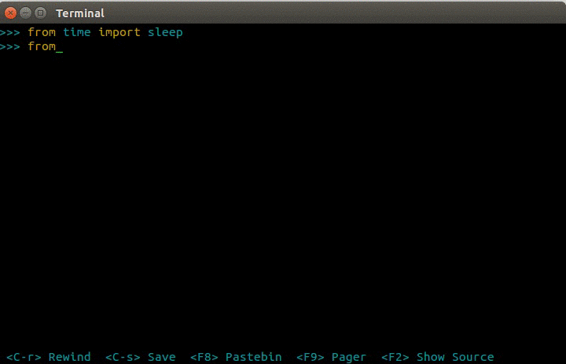

|Logo|

tqdm
====

| |Build Status|
| |Coverage Status|

tqdm (read taqadum, تقدّم) means "progress" in arabic.

Instantly make your loops show a progress meter - just wrap any
iterable with "tqdm(iterable)", and you're done!

.. code:: python

    from tqdm import tqdm
    for i in tqdm(range(16)):
        ...

Here's what the output looks like:

76%\|████████████████████\ ```` ```` \| 7641/10000 [00:34<00:10,
222.22 it/s]

You can also use ``trange(N)`` as a shortcut for ``tqdm(xrange(N))``

|Screenshot|

Overhead is low -- about 60ns per iteration (80ns with ``gui=True``).
By comparison, the well established
`ProgressBar <https://code.google.com/p/python-progressbar/>`__ has
an 800ns/iter overhead. It's a matter of taste, but we also like to think our
version is much more visually appealing.

Installation
------------

Latest pypi stable release
~~~~~~~~~~~~~~~~~~~~~~~~~~

.. code:: sh

    pip install tqdm

Latest development release on github
~~~~~~~~~~~~~~~~~~~~~~~~~~~~~~~~~~~~

Pull and install in the current directory:

::
    pip install -e git+https://github.com/tqdm/tqdm.git@master#egg=tqdm

Documentation
-------------

.. code:: python

    class tqdm:
        """
        Decorate an iterable object, returning an iterator which acts exactly
        like the orignal iterable, but prints a dynamically updating
        progressbar every time a value is requested.
        """
        def __init__(self, iterable=None, desc=None, total=None, leave=False,
                     file=sys.stderr, ncols=None, mininterval=0.1,
                     miniters=None, ascii=None, disable=False,
                     unit='it', unit_scale=False, gui=False):
            """
            Parameters
            ----------
            iterable  : iterable, optional
                Iterable to decorate with a progressbar.
                Leave blank [default: None] to manually manage the updates.
            desc  : str, optional
                Prefix for the progressbar [default: None].
            total  : int, optional
                The number of expected iterations. If not given, len(iterable) is
                used if possible. As a last resort, only basic progress
                statistics are displayed (no ETA, no progressbar). If `gui` is
                True and this parameter needs subsequent updating, specify an
                initial arbitrary large positive integer, e.g. int(9e9).
            leave  : bool, optional
                If [default: False], removes all traces of the progressbar
                upon termination of iteration.
            file  : `io.TextIOWrapper` or `io.StringIO`, optional
                Specifies where to output the progress messages
                [default: sys.stderr]. Uses `file.write(str)` and `file.flush()`
                methods.
            ncols  : int, optional
                The width of the entire output message. If specified, dynamically
                resizes the progressbar to stay within this bound
                [default: None]. The fallback is a meter width of 10 and no
                limit for the counter and statistics. If 0, will not print any
                meter (only stats).
            mininterval  : float, optional
                Minimum progress update interval, in seconds [default: 0.1].
            miniters  : int, optional
                Minimum progress update interval, in iterations [default: None].
                If specified, will set `mininterval` to 0.
            ascii  : bool, optional
                If [default: None] or false, use unicode (▏▎▋█ █) to fill
                the meter. The fallback is to use ASCII characters `1-9 #`.
            disable : bool
                Whether to disable the entire progressbar wrapper [default: False].
            unit  : str, optional
                String that will be used to define the unit of each iteration
                [default: 'it'].
            unit_scale  : bool, optional
                If set, the number of iterations will be reduced/scaled
                automatically and a metric prefix following the
                International System of Units standard will be added
                (kilo, mega, etc.) [default: False].
            gui  : bool, optional
                If set, will attempt to use matplotlib animations for a
                graphical output [default: false].

            Returns
            -------
            out  : decorated iterator.
            """

        def update(self, n=1):
            """
            Manually update the progress bar, useful for streams
            such as reading files.
            E.g.:
            >>> t = tqdm(total=filesize) # Initialise
            >>> for current_buffer in stream:
            ...    ...
            ...    t.update(len(current_buffer))
            >>> t.close()
            The last line is highly recommended, but possibly not necessary if
            `t.update()` will be called in such a way that `filesize` will be
            exactly reached and printed.

            Parameters
            ----------
            n  : int
                Increment to add to the internal counter of iterations
                [default: 1].
            """

        def close(self):
            """
            Cleanup and (if leave=False) close the progressbar.
            """

    def trange(*args, **kwargs):
        """
        A shortcut for tqdm(xrange(*args), **kwargs).
        On Python3+ range is used instead of xrange.
        """

Examples and Advanced Usage
~~~~~~~~~~~~~~~~~~~~~~~~~~~

See the ``examples`` folder.

``tqdm`` can easily support callbacks/hooks and manual updates.
Here's an example with ``urllib``:

**urllib.urlretrieve documentation**

    | [...]
    | If present, the hook function will be called once
    | on establishment of the network connection and once after each
      block read
    | thereafter. The hook will be passed three arguments; a count of
      blocks
    | transferred so far, a block size in bytes, and the total size of
      the file.
    | [...]

.. code:: python

    import tqdm
    import urllib

    def my_hook(**kwargs):
        t = tqdm.tqdm(**kwargs)
        last_b = [0]

        def inner(b=1, bsize=1, tsize=None, close=False):
            if close:
                t.close()
                return
            t.total = tsize
            t.update((b - last_b[0]) * bsize) # manually update the progressbar
            last_b[0] = b
        return inner

    eg_link = 'http://www.doc.ic.ac.uk/~cod11/matryoshka.zip'
    eg_hook = my_hook(unit='B', unit_scale=True, leave=True, miniters=1,
                      desc=eg_link.split('/')[-1]) # all optional kwargs
    urllib.urlretrieve(eg_link,
                       filename='/dev/null', reporthook=eg_hook, data=None)
    eg_hook(close=True)

It is recommend to use ``miniters=1`` whenever there is potentially
large differences in iteration speed (e.g. downloading a file over
a patchy connection).

Contributions
-------------

To run the testing suite please make sure tox (http://tox.testrun.org/)
is installed, then type ``tox`` from the command line.

Alternatively if you don't want to use ``tox``, a Makefile is provided
with the following command:

.. code:: sh

    $ make flake8
    $ make test
    $ make coverage

See the `CONTRIBUTE <CONTRIBUTE>`__ file for more information.

License
-------

`MIT LICENSE <LICENSE>`__.

Authors
-------

-  Noam Yorav-Raphael (noamraph, Original Author)
-  Ivan Ivanov (obiwanus)
-  Mikhail Korobov (kmike)
-  Hadrien Mary (hadim)
-  Casper da Costa-Luis (casperdcl)
-  Stephen Larroque (lrq3000)

.. |Logo| image:: logo.png
.. |Build Status| image:: https://travis-ci.org/tqdm/tqdm.svg?branch=master
   :target: https://travis-ci.org/tqdm/tqdm
.. |Coverage Status| image:: https://coveralls.io/repos/tqdm/tqdm/badge.svg
   :target: https://coveralls.io/r/tqdm/tqdm

